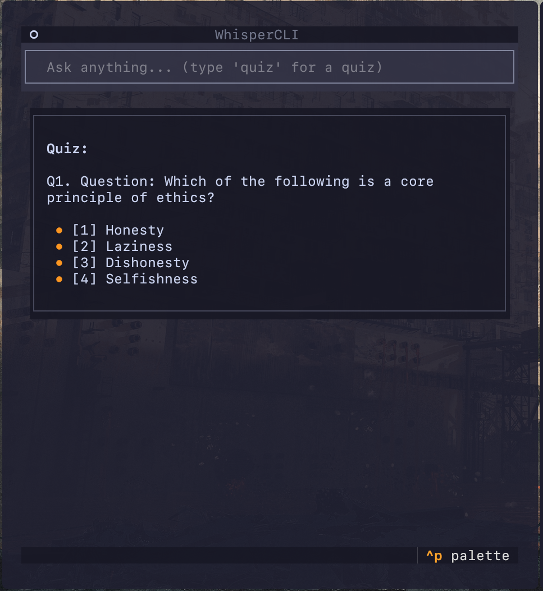

<h1 align="center" style="background-color:#1e1e2e; padding: 12px 0; border-radius: 12px;">
  
  <br/>
  <span style="color:#cdd6f4; font-size: 28px;">Whisper</span>
</h1>

<h6 align="center" style="color:#a6adc8; margin-top: -8px;">
  a real-time, ai-powered revision assistant.
</h6>

<h6 align="center" style="color:#5c5f77; margin-top: -12px;">
  a real-time, ai-powered exam revision assistant.
</h6>
<p align="center">
  <a href="https://github.com/ryu-ryuk/exam-whisperer/stargazers">
    
  </a>
  <a href="https://github.com/ryu-ryuk/exam-whisperer/issues">
    
  </a>
  <a href="https://github.com/ryu-ryuk/exam-whisperer/blob/main/LICENSE">
    
  </a>
</p>

<p align="center">
  
  
  
  
<!--    -->
</p>

<p align="center" style="color:#bac2de; font-size: 14.5px; line-height: 1.6; max-width: 700px; margin: auto;">
  <strong style="color:#cdd6f4;">Whisper</strong> is a real-time exam revision agent that helps you <em>learn</em>, not just get answers.<br/>
  it explains concepts, quizzes you, and tracks topic mastery using <span style="color:#89b4fa;">LLMs</span> and <span style="color:#cba6f7;">Pathway</span> in a continuous feedback loop.<br/><br/>
  <em style="color:#f38ba8;">built during Code Cubicle 4.0 — not another chatbot, but a real-time learning agent.</em>
</p>


## why whisper?

llm tools answer questions, but they don't **help you learn**.  
whisper does.

- explains doubts clearly  
- quizzes meaningfully by topic  
- tracks learning progress  
- suggests what to revise next  

---

## features

| endpoint | purpose |
|----------|---------|
| `POST /ask`      | clean explanation of any concept |
| `POST /quiz`     | generates mcqs or short-answer sets |
| `POST /answer`   | logs attempts and scores |
| `GET /progress`  | real-time topic mastery tracking |
| `voice support`  | speak your doubts, hear answers (via whisper + tts) |

---

## tech stack

**core backend**
- `fastapi` — web api
- `pathway` — real-time stream processor (learning analytics)
- `postgres` — persistence
- `openai` or `ollama` — model backend (explanations, quizzes)

**optional**
- `whisper` — speech-to-text
- `tts` — voice replies

---

## 🔁 adaptive learning

your actions stream into pathway, which builds a live topic profile:

- score trends (improving, plateauing)
- weak topic detection
- revision suggestions

> **example**  
> vectors quiz scores: 40% → 60% → 70%  
> result: not mastered → "revise dot product again"

---

## 📦 usage

run from the `backend/` folder:

```bash
# build containers
make rebuild

# run server
make up

# run knowledge flow (pathway)
python3 src/pathway_flow/pathway_main.py
```

- open [swagger](http://localhost:8000/docs) for api docs.

## 🐳 docker setup 

- for production 

```sh 
docker compose up --build
```
add your `.env`

```ini
SERVER_PORT=8000
POSTGRES_USER=dev
POSTGRES_PASSWORD=dev
POSTGRES_DB=dev
```

## todo

* enhance and minimalize frontend
* leaderboard & gamification
* spaced repetition engine

## 🖼preview


## 📜 license
[MIT](LICENSE) — built by zen with a lot of stress (๑•́‿•̀๑)
